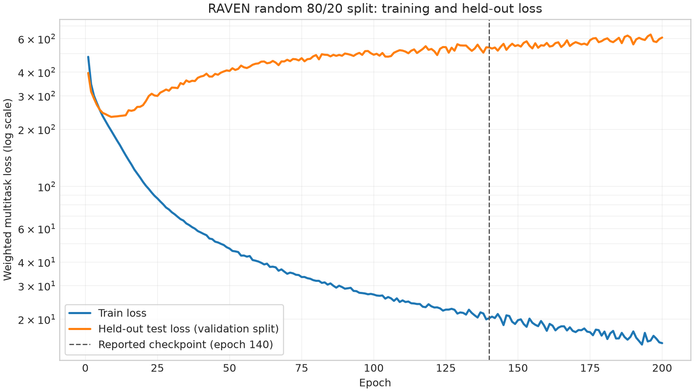
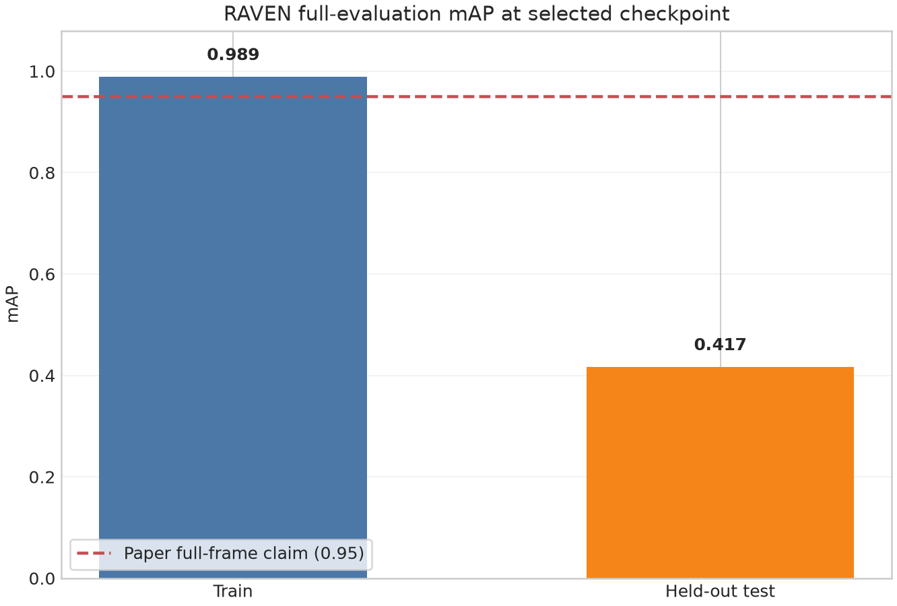

# RAVEN on RADIal: unofficial reproduction

This repository packages a standalone training and evaluation pipeline for
the raw-ADC radar network introduced in
[RAVEN: Radar Adaptive Vision Encoders for Efficient Chirp-wise Object Detection and Segmentation (CVPR'26)](https://openaccess.thecvf.com/content/CVPR2026/html/Sen_RAVEN_Radar_Adaptive_Vision_Encoders_for_Efficient_Chirp-wise_Object_Detection_CVPR_2026_paper.html).
It uses label-aligned RADIal raw ADC frames and jointly predicts vehicle
detections and free-space segmentation.

> **Important:** this is an independent, unofficial reproduction. The paper
> authors **have not open-sourced** the RAVEN implementation, so parts of
> the architecture and training pipeline had to be reconstructed from the
> paper and the available research material. I have not been able to reproduce
> the performance claimed in the paper with this implementation. The purpose
> of publishing this repository is to make the reproduction attempt
> transparent and to invite interested researchers to inspect it, identify
> discrepancies, and reproduce the results together.


## Latest random-split reproduction result

> **Split-protocol note:** RAVEN and SSMRadNet use a **random split** on RADIal,
> whereas most other baselines reported on RADIal use **sequence-disjoint splits**
> to prevent highly similar frames from the same driving sequence leaking
> across training and evaluation; despite this leakage risk, this reproduction
> retains the random split to remain consistent with the RAVEN paper's stated
> experimental protocol.

The following result comes from the completed 200-epoch run
`RAVEN_rawADC_random80-20__2026-07-22_13-58-48-125406`. It uses a deterministic
random 80/20 frame split with 6,601 training frames and 1,651 held-out frames.
Because this split has no separate test partition, the held-out validation
partition is called **held-out test** only in this report. It must not be
interpreted as an additional independent test set.

The reported model is `best_balanced.pth` from epoch 140. During training this
checkpoint maximized `(fixed-threshold F1 + mIoU) / 2` on the held-out split.
The curves below show all 200 epochs. At epoch 200, train loss is `14.97` while
held-out loss is `608.41`, showing a severe generalization gap.



Detection was recomputed on both partitions with the same full-evaluation
logic as the released `RADIal-main/FFTRadNet/utils/metrics.py::GetFullMetrics`:
decode at 0.05, confidence thresholds 0.1 through 0.9, NMS IoU 0.05, matching
IoU 0.5, and range 5-100 m. Near-range freespace mIoU uses the first 124 range
rows. Under this released convention, `mAP` is the mean of dataset-level
precision values across the nine confidence thresholds; it is not the area
under an interpolated precision-recall curve. The released matching behavior
also permits multiple predictions to match the same ground-truth box.



| Metric | Train, reproduced | Held-out test, reproduced | RAVEN paper, full frame | Held-out gap vs. paper |
|---|---:|---:|---:|---:|
| mIoU ↑ | 0.916 | 0.757 | 0.900 | -0.143 |
| F1 ↑ | 0.993 | 0.349 | 0.930 | -0.581 |
| mAP ↑ | 0.989 | 0.417 | 0.950 | -0.533 |
| mAR ↑ | 0.997 | 0.301 | 0.920 | -0.619 |
| Range error (m) ↓ | 0.072 | 0.182 | 0.120 | +0.062 |
| Azimuth error (degrees) ↓ | 0.110 | 0.412 | 0.100 | +0.312 |
| Parameters (M) ↓ | 1.427 | 1.427 | 1.510 | -0.083 |
| GMACs ↓ | 1.125 | 1.125 | 1.020 | +0.105 |
| Latency (ms) ↓ | not measured | not measured | 20.08 | not available |

The paper values are the **RAVEN (Full Frame, Ours)** row in Table 2 of the
CVPR 2026 paper. The reproduced train scores show that the model has enough
capacity to fit the training data, but the much lower held-out detection
scores show strong overfitting rather than successful reproduction of the
paper's claimed generalization. Protocol differences may still remain because
the authors have not released their complete implementation, preprocessing,
split indices, or trained checkpoint.

The exact report inputs are retained in
`assets/results/random80-20-summary.json`. Re-run the two full evaluations and
figures with:

```bash
python evaluate_raven_full.py \
  --config /path/to/run/config.json \
  --checkpoint /path/to/run/best_balanced.pth \
  --dataset-root /path/to/RAVEN_RADIal \
  --split train \
  --output /path/to/run/raven_full_train.json

python evaluate_raven_full.py \
  --config /path/to/run/config.json \
  --checkpoint /path/to/run/best_balanced.pth \
  --dataset-root /path/to/RAVEN_RADIal \
  --split val \
  --output /path/to/run/raven_full_val.json

python tools/generate_training_report.py \
  --run-dir /path/to/run \
  --output-dir assets/results
```

## Current reproduced architecture and end-to-end data flow

The paper reports
approximately **1.511M parameters and 1.023G operations** for RAVEN, but some
decoder dimensions, implementation details, and profiling conventions are not
disclosed. The executable reconstruction in this repository has:

- **1,427,460 trainable parameters**;
- **1.125 GMAC** under the explicit analytical convention implemented in
  `raven_repro/models/raven_profile.py`;
- the paper-described 16 independent RX fast-time SSMs, antenna mixer,
  chirp-wise SSM, 32 x 56 BEV projection, and separate detection and
  segmentation decoding paths.

Run `python profile_model.py` to reproduce these numbers. Do not present the
current parameter/MAC values as an exact official implementation; report both
the paper values and the values measured from this code.

The following description documents the model that is actually implemented
in this repository. Dimensions are taken from
`configs/raven_raw_adc_sequence.json`. They should not be interpreted as
confirmed dimensions of the authors' unreleased implementation.

### 1. Raw-sequence decoding and model input

1. `SyncReader` retrieves the four synchronized radar-chip streams for each
   frame selected by the released `labels.csv`.
2. Each chip is decoded in Fortran order to
   `[sample=512, chirp=256, RX-per-chip=4]`.
3. The four chips are concatenated in receiver order `[chip3, chip0, chip1,
   chip2]`, producing one complex frame `[512, 256, 16]`.
4. No DC component is removed. No FFT, normalization, or amplitude transform
   is applied. The unscaled complex frame is stored in `ADC_Data`.
5. The DataLoader casts each frame to `complex64`, permutes it, and returns
   `[B, RX=16, samples=512, chirps=256]`.
6. `RAVENADC` separates real and imaginary values and concatenates all real RX
   channels before all imaginary RX channels. The RAVEN input is therefore
   `[B, chirps=256, samples=512, channels=32]`.

The network does not calculate a range FFT or Doppler FFT. It operates
directly on raw ADC samples.

### 2. Per-RX fast-time SSM

For every chirp, the input is separated into 16 receiver sequences. Receiver
`r` has shape `[B, 256, 512, 2]`, where the final dimension contains its real
and imaginary values. It is reshaped to `[B*256, 512, 2]` and processed by an
independent Mamba block:

| Setting | Current value |
|---|---:|
| Number of independent RX SSMs | 16 |
| Mamba `d_model` | 2 |
| Mamba `d_state` | 16 |
| Mamba `d_conv` | 4 |
| Mamba expansion | 2 |
| Fast-time SSM layers per RX | 1 |

The complete 512-sample Mamba output is average-pooled along the sample axis.
Each receiver consequently produces one two-dimensional token per chirp. The
combined output is `[B, 256, 16, 2]`. This path does not select only the final
sample state and does not concatenate a separate chirp token.

### 3. Antenna mixer and virtual-MIMO features

Each two-dimensional RX token is linearly projected from `2 -> 64`, and a
learned RX embedding `[16, 64]` is added. Twelve learned TX queries
`[12, 64]` cross-attend to the 16 RX tokens independently for every chirp.
The mixer uses eight attention heads and a residual feed-forward path
`64 -> 256 -> 64`.

Every RX feature is then paired with every attended TX feature. The
concatenated 128-dimensional pair is projected to two values. This gives
`16 RX x 12 TX x 2 = 384` virtual-MIMO features per chirp:

```text
[B, 256, 16, 2]
  -> RX projection and learned RX embeddings [B*256, 16, 64]
  -> 12 learned TX queries with 8-head cross-attention [B*256, 12, 64]
  -> all RX/TX pairs [B*256, 16, 12, 128]
  -> pair projection 128 -> 2
  -> flatten and LayerNorm [B, 256, 384]
```

The learned RX embeddings and TX queries are the antenna identity mechanism
in the current model. No separate sample-position or chirp-position encoding
is added.

### 4. Chirp-wise SSM backbone

The 384-dimensional virtual-MIMO token is reduced with
`Linear(384, 234) + SiLU`, followed by `Linear(234, 234) + SiLU`. A causal
Mamba block then processes the sequence of 256 chirps:

| Setting | Current value |
|---|---:|
| Chirp token width (`d_model`) | 234 |
| Sequence length | 256 chirps |
| Mamba `d_state` | 16 |
| Mamba `d_conv` | 4 |
| Mamba expansion | 2 |
| Chirp SSM layers | 1 |

The encoded frame has shape `[B, 256, 234]`.

### 5. Separate sequence-to-BEV projections

Detection and segmentation do not share a BEV projection. Each branch first
transposes the encoded sequence to `[B, 234, 256]` and applies a `Conv1D` with
kernel size one from `234 -> 32*56 = 1792`. Adaptive average pooling then
compresses the chirp axis to a task-specific number of temporal bins:

| Branch | Projected sequence | Pooled BEV tensor |
|---|---|---|
| Detection | `[B, 1792, 256]` | `[B, 32, 32, 56]` |
| Segmentation | `[B, 1792, 256]` | `[B, 16, 32, 56]` |

Here the final two dimensions, `32 x 56`, are the initial BEV spatial grid;
the first post-batch dimension is a pooled temporal/channel dimension.

### 6. Detection decoder

The detection decoder uses `Conv2D -> LayerNorm2D -> SiLU` blocks:

```text
[B, 32, 32, 56]
  -> Conv 32 -> 16                         [B, 16, 32, 56]
  -> Conv 16 -> 16                         [B, 16, 32, 56]
  -> bilinear resize                       [B, 16, 64, 112]
  -> Conv 16 -> 8                          [B, 8, 64, 112]
  -> bilinear resize                       [B, 8, 128, 224]
  -> Conv 8 -> 8                           [B, 8, 128, 224]
  -> sigmoid classification head 8 -> 1    [B, 1, 128, 224]
  -> regression head 8 -> 2                [B, 2, 128, 224]
  -> concatenated detection output         [B, 3, 128, 224]
```

Channel zero is the vehicle confidence map. Channels one and two are the
normalized range and angle offsets used by the RADIal target encoder.

### 7. Segmentation decoder

The segmentation branch uses the same block ordering but has its own weights:

```text
[B, 16, 32, 56]
  -> Conv 16 -> 16                         [B, 16, 32, 56]
  -> bilinear resize                       [B, 16, 64, 112]
  -> Conv 16 -> 16                         [B, 16, 64, 112]
  -> Conv 16 -> 8                          [B, 8, 64, 112]
  -> bilinear resize                       [B, 8, 128, 224]
  -> Conv 8 -> 8                           [B, 8, 128, 224]
  -> logit head 8 -> 1                     [B, 1, 128, 224]
  -> bilinear resize                       [B, 1, 256, 224]
```

The output contains free-space logits. Sigmoid is applied by the loss or
evaluation code rather than inside the segmentation decoder.

### 8. Targets and default multitask loss

The detection target has shape `[B, 3, 128, 224]`: one classification map and
two normalized regression maps. The free-space target is a binary map
`[B, 1, 256, 224]`. The default configuration combines:

```text
total loss = 2 * focal classification loss
           + 100 * Smooth-L1 regression loss
           + 100 * BCE-with-logits segmentation loss
```

Regression loss is evaluated at positive detection cells and normalized by
the number of positive cells. Alternative Jaccard segmentation loss is
implemented and can be selected in the JSON configuration.

### 9. Parameter distribution and disclosed assumptions

| Logical component | Parameters in this implementation |
|---|---:|
| 16 fast-time RX SSMs | 4,032 |
| Antenna mixer | 53,056 |
| Chirp projection and chirp SSM | 512,928 |
| Two BEV projections and task decoders | 857,444 |
| **Total** | **1,427,460** |

The mixer width, attention heads, Mamba state/convolution/expansion settings,
and `32 x 56` BEV grid are based on the paper description. The current
`chirp_dim=234` is inferred from the reported chirp-block parameter budget.
The detection/segmentation temporal bins (`32` and `16`) and decoder width
(`16`) are not fully specified in the paper and remain reproduction
assumptions. These unresolved choices are a possible reason the current model
does not achieve the reported performance.

## Repository layout

```text
configs/                         sequence and random-split experiments
raven_repro/models/              RAVEN, input adapter, analytical profiler
raven_repro/data/                dataset, target encoder, deterministic splits
raven_repro/training/            losses, loops, atomic checkpoints
raven_repro/evaluation/          matching, NMS, metrics, threshold sweeps
tools/adc_processing/            chip decoding and calibration-aware ADC path
third_party/radial_dbreader/     synchronized raw-sequence reader
train.py                         training and resume entry point
evaluate.py                      train/val/test evaluation entry point
evaluate_raven_full.py           RAVEN full evaluation using the released RADIal protocol
profile_model.py                 parameters and analytical MAC report
```

## 1. Environment

The current reproduction was verified in WSL2 with Python 3.12, PyTorch
2.13.0+cu130, CUDA, and an RTX 4080. A CUDA installation compatible with the
selected PyTorch wheel is required for practical training.

```bash
git clone <YOUR-GITHUB-REPOSITORY-URL>
cd RAVEN_RADIal_Reproduction

conda create -n raven python=3.12 -y
conda activate raven

# Install the PyTorch build appropriate for your CUDA installation first.
# Then install the remaining packages.
python -m pip install -r requirements.txt
```

If `mamba-ssm` must compile against the installed PyTorch/CUDA build, this is
often preferable:

```bash
python -m pip install packaging ninja
python -m pip install mamba-ssm --no-build-isolation
```

In the environment used to develop this repository, commands are run as:

```bash
export LD_LIBRARY_PATH="$CONDA_PREFIX/lib:/usr/local/cuda/lib64:$LD_LIBRARY_PATH"
```

## 2. Prepare the RADIal assets

You need:

1. the official RADIal raw sequence directories;
2. the filtered `labels.csv` from the ready-to-use RADIal release;
3. the official `radar_Freespace` directory;
4. Valeo's official `CalibrationTable.npy`.

Download and checksum the calibration table:

```bash
python tools/download_calibration.py
```

Create the minimal dataset layout. The free-space directory is linked rather
than copied:

```bash
python tools/prepare_dataset.py \
  --dataset-root /home/$USER/datasets/RAVEN_RADIal \
  --labels /path/to/ready_to_use/RADIal/labels.csv \
  --freespace /path/to/ready_to_use/RADIal/radar_Freespace
```

Expected layout:

```text
/home/$USER/datasets/RAVEN_RADIal/
  labels.csv
  radar_Freespace/               freespace_NNNNNN.png
  ADC_Data/                      adc_NNNNNN.npy
    .adc_preprocessing.json
```

Build ADC files using the official label rows to select source frames from
the synchronized sequences:

```bash
python tools/build_adc_dataset.py \
  --raw-root /path/to/RADIal/raw_sequences \
  --labels /home/$USER/datasets/RAVEN_RADIal/labels.csv \
  --output-dir /home/$USER/datasets/RAVEN_RADIal/ADC_Data \
  --calibration assets/CalibrationTable.npy
```

Use `--max-samples 10` for a conversion smoke test. Existing valid files are
resumed safely. Use `--overwrite` only when intentionally rebuilding every
file under `ADC_Data`; an interrupted overwrite must also be resumed with
`--overwrite`. The builder writes a manifest, and training refuses incomplete,
DC-removed, or amplitude-transformed caches.

If an existing cache was generated by an earlier version of this repository,
rebuild it with `--overwrite`. The current manifest contract requires unscaled
ADC values and intentionally rejects older transformed caches.

The generated complex128 files are about 32 MiB per frame, approximately
258 GiB for 8,252 frames. Training casts loaded frames to complex64.

## 3. Inspect the model

```bash
python profile_model.py \
  --config configs/raven_raw_adc_sequence.json
```

The default config requires the actual `mamba-ssm` backend. For lightweight
unit tests, the code also contains a shape-compatible `fallback` backend, but
that backend is not numerically equivalent and must not be used for reported
experiments.

## 4. Train

Sequence-based split:

```bash
python -u train.py \
  --config configs/raven_raw_adc_sequence.json \
  --dataset-root /home/$USER/datasets/RAVEN_RADIal
```

Random 80/20 split:

```bash
python -u train.py \
  --config configs/raven_raw_adc_random80_20.json \
  --dataset-root /home/$USER/datasets/RAVEN_RADIal
```

The supplied random-split configuration trains for 200 epochs with a constant
Adam learning rate of `1e-4` (no learning-rate decay). It evaluates and prints
validation precision, recall, F1, mIoU, balanced score, TP, FP, and FN from the
first epoch. An epoch checkpoint is saved after every epoch.

The split is deterministic from the configured seed and is saved in
`split.json`. The random 80/20 configuration has no independent test subset;
`test` intentionally aliases `val`, which is recorded in checkpoints and
evaluation output. The sequence configuration uses fixed held-out validation
and test sequences.

To resume the same run:

```bash
python -u train.py \
  --config /path/to/run/config.json \
  --resume /path/to/run/last.pth \
  --dataset-root /home/$USER/datasets/RAVEN_RADIal
```

The resume checkpoint restores model, optimizer, scheduler, AMP scaler,
epoch, history, best scores, and exact split indices. It continues writing to
the checkpoint's existing run directory.

Each run contains:

- `last.pth`, updated every epoch;
- periodic epoch checkpoints. When metrics are active, filenames contain the
  epoch, validation loss, precision, recall, F1, mIoU, and balanced score, for
  example
  `epoch_001_valloss_100.0000_P_0.1000_R_0.2000_F1_0.1333_mIoU_0.7000_Bal_0.4167.pth`;
- `best_val_loss.pth`, `best_f1.pth`, `best_miou.pth`, and
  `best_balanced.pth`;
- `config.json`, `split.json`, `history.json`, `history.csv`, and TensorBoard
  events.

`best_balanced.pth` maximizes `(F1 + mIoU) / 2`. Metrics are deferred until
`training.metrics_start_epoch`; validation loss is still computed every epoch.
Change training settings in a copied JSON config rather than editing Python.

Monitor a run with:

```bash
tensorboard --logdir outputs
```

## 5. Evaluate

Evaluate the training subset to diagnose underfitting or overfitting:

```bash
python -u evaluate.py \
  --config /path/to/run/config.json \
  --checkpoint /path/to/run/best_val_loss.pth \
  --dataset-root /home/$USER/datasets/RAVEN_RADIal \
  --split train
```

Evaluate validation and test subsets:

```bash
python -u evaluate.py --config /path/to/run/config.json \
  --checkpoint /path/to/run/best_val_loss.pth \
  --dataset-root /home/$USER/datasets/RAVEN_RADIal --split val

python -u evaluate.py --config /path/to/run/config.json \
  --checkpoint /path/to/run/best_val_loss.pth \
  --dataset-root /home/$USER/datasets/RAVEN_RADIal --split test
```

By default, evaluation tests every confidence and IoU threshold from 0.1 to
0.9. Custom grids are accepted as comma-separated values:

```bash
python -u evaluate.py \
  --config /path/to/run/config.json \
  --checkpoint /path/to/run/best_val_loss.pth \
  --dataset-root /home/$USER/datasets/RAVEN_RADIal \
  --split test \
  --confidence 0.1,0.2,0.3,0.4,0.5 \
  --iou 0.1,0.3,0.5,0.7
```

Evaluation writes `metrics.json` and `detection_sweep.csv`. Confidence and IoU
are different quantities: confidence filters predictions, while IoU controls
prediction-to-ground-truth matching. Detection matching is greedy and
one-to-one after NMS. The fixed detection summary reports precision, recall,
and F1; it is not mislabeled as dataset-level mean average precision.

## 6. Tests

```bash
python -m pytest -q
python -m compileall -q .
```

Before publishing a result, also perform one real-data forward/backward smoke
test in the same CUDA environment and retain the run config and split file:

```bash
python tests/smoke_real_data.py \
  --dataset-root /home/$USER/datasets/RAVEN_RADIal \
  --device cuda
```

## Reporting guidance

Use [EXPERIMENTS.md](EXPERIMENTS.md) as a result-table template. For a fair
comparison, report split type, ADC amplitude preprocessing, DC removal, model
parameter count, profiling convention, checkpoint selection rule, confidence
threshold, and IoU threshold. Random frame splits can leak sequence-level
similarity and should not be compared directly with sequence-held-out results
without a warning.

Results from this repository should be labeled **unofficial reproduction
results**. Negative or lower-than-paper results are useful: please include the
exact config, split, checkpoint rule, and evaluation thresholds when opening an
issue or contributing a pull request so the community can diagnose differences
together.

## Attribution and license status

See [THIRD_PARTY_NOTICE.md](THIRD_PARTY_NOTICE.md). In particular, the upstream
T-FFTRadNet tree used during this work did not include an explicit license.
This repository therefore does not invent one. Resolve third-party licensing
and permissions before making the GitHub repository public.
